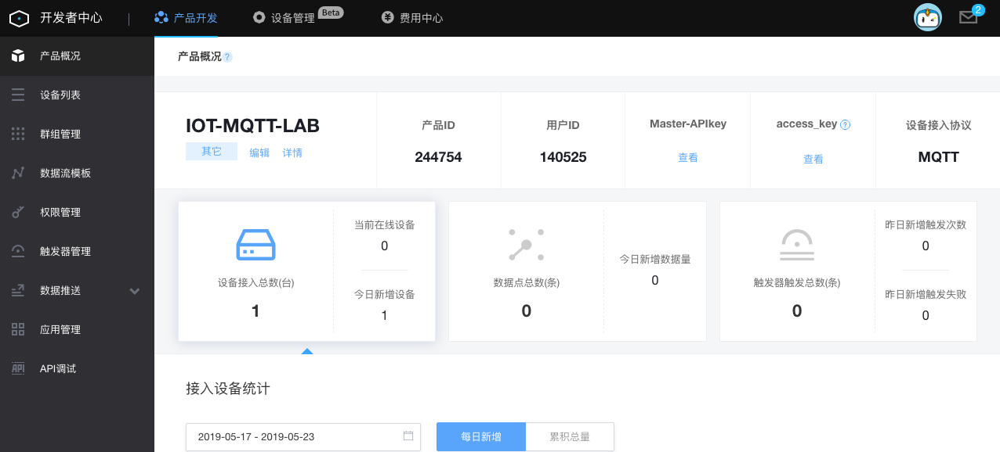

# MQTT-与oneNET平台交互

## OneNET物联网平台介绍

OneNET是**中国移动**提供的开放式IOT PaaS服务。即在物联网应用和真实设备之间搭建高效、稳定、安全的应用平台：面向设备，适配多种网络环境和常见传输协议，提供各类硬件终端的快速接入方案和设备管理服务；面向应用层，提供丰富的API和数据分发能力以满足各类行业应用系统的开发需求，使物联网企业可以更加专注于自身应用的开发，而不用将工作重心放在设备接入层的环境搭建上，从而缩短物联网系统的形成周期，降低企业研发、运营和运维成本。

### OneNET提供的主要功能：

1. 设备接入：支持CoAP（LWM2M）、MQTT、Modbus、HTTP等协议。
2. 设备管理
3. 数据访问
4. 应用集成

### 平台架构


**设备接入协议规则**

- 在考虑低功耗以及广覆盖的场景，建议使用CoAP协议接入
- 在工业modbus通信场景，建议使用DTU+Modbus协议接入
- 在需要与设备实时通信的场景，建议采用MQTT协议接入
- 在设备单纯上报数据的场景，可以使用HTTP/HTTPS协议接入
- 在用户需要自定义协议接入的场景，建议采用TCP+脚本的方式接入

更多详细开发内容请参考[官方开发文档](https://open.iot.10086.cn/doc/)

## 注册OneNET账户并添加设备

### 注册账户与登录

> 以下为简单的注册概要，更多详情，请参见官方文档[账户与登录](https://open.iot.10086.cn/doc/book/easy-manual/login.html)部分。

[注册OneNET用户](https://open.iot.10086.cn/)

### 创建产品

> 以下为简单的注册概要，更多详情，请参见官方文档[创建产品](https://open.iot.10086.cn/doc/book/easy-manual/product&device/product-create.html)部分。

进入[开发者中心](https://open.iot.10086.cn/develop/global/product)，创建产品，产品接入协议选择`MQTT`，如下图


进入设备详情，记录下设备ID，产品ID，以及API KEY参数。如下图



### 添加设备

详细指导请参见官方文档，[创建单个设备](https://open.iot.10086.cn/doc/book/easy-manual/product&device/device-create/single-device.html)

添加设备是，设备的**鉴权信息**请最好使用设备标识号，对于ESP32，可以考虑使用出厂MAC地址，需要去掉地址中的冒号`:` 。

请记录下**设备ID** , 以备程序调用。

## 接入OneNET并实现远程控制

### 接入WIFI网络

首先，设备必须通过WiFi接入公网才能访问OneNET的MQTT服务。如何接入WIFI，请参见[WIFI网络实验](wifi_network_connection.md)

### 接入OneNET

> 更多详细的MQTT接入说明请参见[MQTT接入说明](https://open.iot.10086.cn/doc/book/device-develop/multpro/MQTT/MQTT-manual.html)

在即接入OneNET，主要完成两件任务

1. 接入OneNET需要如下用户身份和设备鉴权参数：

| 参数      | 值                                                           |
| --------- | ------------------------------------------------------------ |
| SERVER    | Onenet 服务器 IP地址（183.230.40.39），或域名 mqtt.heclouds.com |
| CLIENT_ID | 设备ID号                                                     |
| TOPIC     | 标识符，b'esp32_mqtt_basic_control'                          |
| username  | 产品ID                                                       |
| password  | 鉴权信息，或者API KEY                                        |

2. 定义远程控制协议并实现

本实验中，设计远程控制方案如下，通过远程发送`on` 或者 `off` 指令，实现GPIO2口的蓝色灯的亮或者灭。即：

| 指令 | 效果                     |
| ---- | ------------------------ |
| on   | 点亮GPIO2相连的蓝色LED灯 |
| off  | 熄灭GPIO2相连的蓝色LED灯 |

接入示例代码如下：

```python
from umqtt.simple import MQTTClient
from machine import Pin
import machine
import micropython
#选择GPIO2引脚
pin2 = Pin(2, Pin.OUT, value=0)
# MQTT服务器地址域名为：183.230.40.39,也可以填写Onenet永久域名，mqtt.heclouds.com
SERVER = "183.230.40.39"
#设备ID
CLIENT_ID = "527521926"
#随便起个名字
TOPIC = b'esp32_mqtt_basic_control'
#产品ID
username='244754'
#设备鉴权信息，或者设备的关联APIKey，此处采用设备鉴权信息，有兴趣的同学可以先创建APIKEY,再将之与该设备关联。
password='3C71BFC80054'
state = 0
def sub_cb(topic, msg):
    global state
    print((topic, msg))
    if msg == b"on":
        pin2.value(1)
        state = 1
        print("1")
    elif msg == b"off":
        pin2.value(0)
        state = 0
        print("0")
    elif msg == b"toggle":
        state = 1 - state
        pin2.value(state)

def main(server=SERVER):
    #端口号为：6002
    c = MQTTClient(CLIENT_ID, server,6002,username,password)
    c.set_callback(sub_cb)
    c.connect()
    c.subscribe(TOPIC)
    print("Connected to %s, subscribed to %s topic" % (server, TOPIC))
    try:
        while 1:
            c.wait_msg()
    finally:
        c.disconnect()
```

请认证阅读以上参考代码，并结合WIFI接入代码，实现MQTT的远程控制代码实现，代码完成后，进入REPL模式，CTRL-D，实现设备软重启，如果程序运行正确，将会显示以下内容：


上述信息表示，设备已经接入OneNET，请回到OneNET的设备列表，发现此时`设备状态`变为**在线**。


接下来，就可以远程发送指令来控制设备了。

## 远程发送指令

### 进入下发命令界面


### 点亮


### 熄灭


指令执行后，请观察开发板蓝色灯是否如指令控制。

